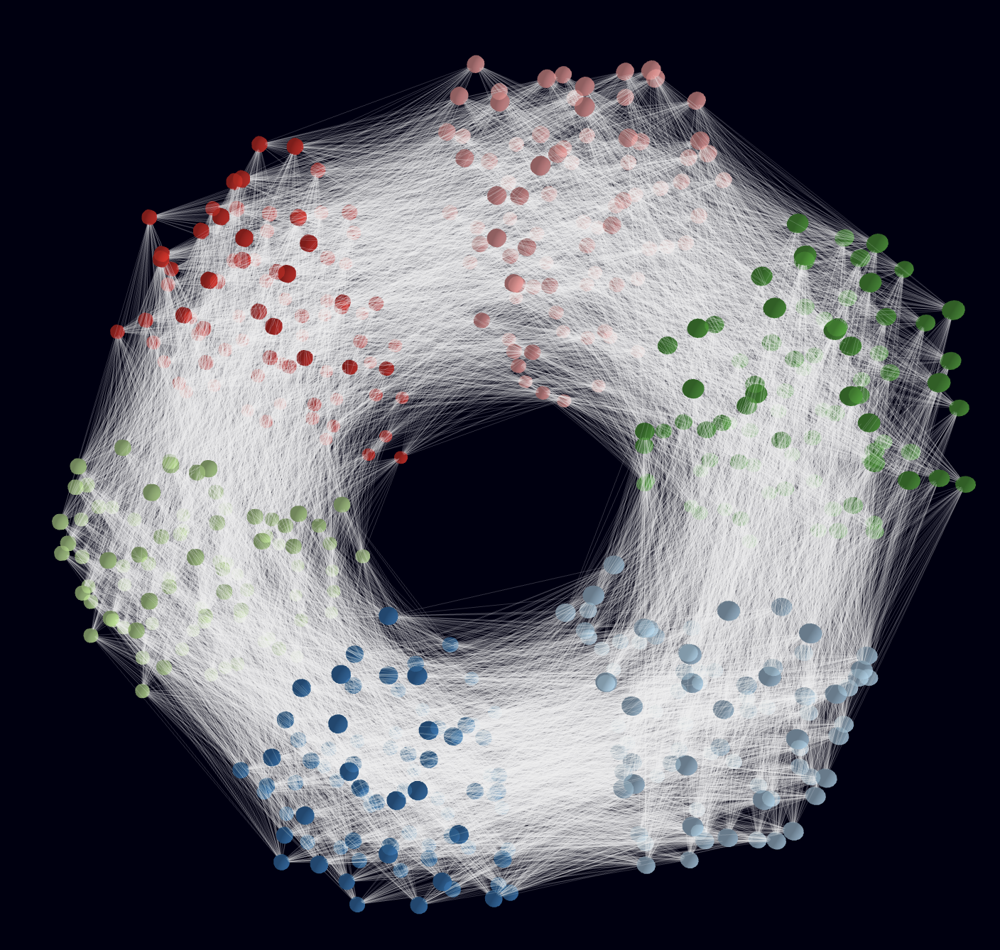
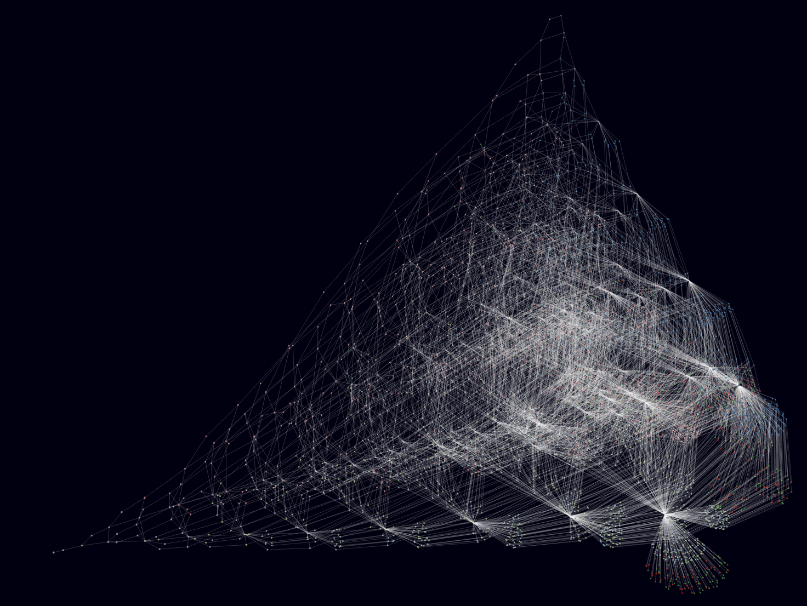
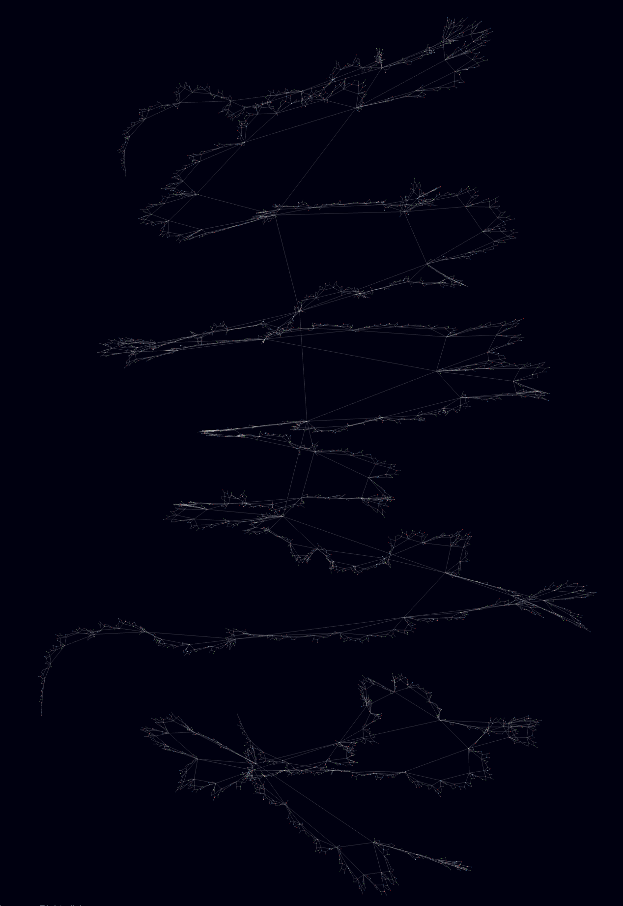

# Natural-integers-relationship-graphs
Simple static webpage that draws 3D graphs of natural integers relationships. Based on vanilla javascript, webworkers and [3D force graph](https://github.com/vasturiano/3d-force-graph).
Available relationships include :
-  A / B is prime
- A + B is prime
- A + B is in the fibonacci sequence
- A + B is in the integers sum sequence

and many more. Please feel free to contribute and ad more findings to the project.

You can try it on the [github hosted page](https://nuel-mathieu.github.io/Natural-integers-relationship-graphs/).
Notable results are :
- Number whos sum is prime up to 500, showing a donut like structure. Node colors represent of a give number n represent the result of n % 6.

- Number whos division is prime up to 5000 : 

- Numbers whos sum belong to the first 5000 fibonacci sequence elements, showing a fractal like stucture :

